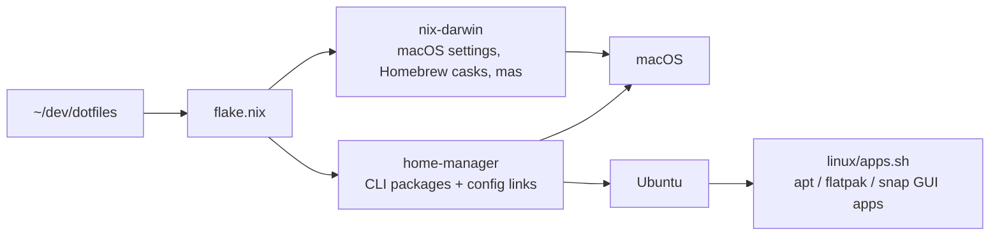

# dotfiles

One repo for macOS (primary) and Ubuntu/Debian (secondary):

- **nix-darwin** (macOS): system settings (trackpad, keyboard, shortcuts, Dock, Finder, …), Touch ID sudo, Homebrew casks + App Store apps.
- **home-manager** (macOS + Linux): the same CLI tools from one list, and every config file, symlinked live from this repo.
- **`dot`**: a small wrapper so you never have to remember the Nix commands.



## Layout

| Path | What lives there |
|---|---|
| `flake.nix` | Entry point: user name/email, the `macbook` and `linux-*` configurations |
| `nix/home/packages.nix` | **CLI tools for every machine** (nixpkgs) |
| `nix/home/default.nix` | Which configs get linked where (shared) |
| `nix/home/darwin.nix`, `linux.nix` | Per-OS extras (zsh files, Karabiner… / fonts, bash→fish) |
| `nix/darwin/defaults.nix` | **macOS settings** |
| `nix/darwin/prefs/*.json` | Captured defaults domains (keyboard shortcuts); applied automatically |
| `nix/darwin/homebrew.nix` | **Mac GUI apps** (casks), App Store apps, tap-only CLI tools |
| `linux/apps.sh` | **Linux GUI apps** (apt repos, Flathub, snap) |
| `config/` | The actual dotfiles (fish, nvim, ghostty, git, mise, starship, …) |
| `bin/dot` | The helper CLI |
| `bootstrap.sh` | New-machine setup |

## Set up a machine

**New Mac or Ubuntu box**, one command (installs Xcode CLT/Homebrew on macOS, Nix, clones the repo to `~/dev/dotfiles`, applies it):

```sh
curl -fsSL https://raw.githubusercontent.com/duffpop/dotfiles/main/bootstrap.sh | bash
```

Then on macOS log out and back in; on Linux run `dot apps` to install the GUI apps.

If a step fails, the script keeps going with every step that doesn't depend on it. It ends with a summary (ok / FAILED / skipped) and the path of a full log in `~/.local/state/dotfiles/bootstrap-*.log`. Fix the problem and re-run the same command; finished steps are no-ops.

If your username on that machine isn't `haydenduffy`, change `user.name` in `flake.nix` first (or fork the value per machine). The repo **must** live at `~/dev/dotfiles`, because configs are symlinked to it.

### Moving this Mac over (first run)

Your current files are left in place as `*.hm-backup` / `*.pre-dotfiles` / `/etc/*.before-nix-darwin`, so nothing is lost.

1. `bash ~/dev/dotfiles/bootstrap.sh` installs Nix and applies everything.
2. Log out and in (some keyboard/trackpad settings only load at login).
3. `dot drift` lists Homebrew formulae now provided by Nix. Remove them so there's one copy of each tool:
   ```sh
   brew uninstall atuin awscli bat biome borders btop bun coder coreutils fd fish fisher fx fzf gh \
     git-delta ipcalc lazygit less lsd mise neovim netwatch npm-check-updates omp pinentry-mac pnpm \
     procs ripgrep rustscan spotify_player starship supabase tealdeer tfenv tree uv yazi zoxide
   brew uninstall --cask session-manager-plugin
   brew untap can1357/tap coder/coder supabase/tap felixkratz/formulae dracula/install
   coder config-ssh   # your ~/.ssh/config hard-codes /opt/homebrew/bin/coder
   ```
4. Once `dot drift` is clean, set `cleanup = "uninstall"` in `nix/darwin/homebrew.nix`. From then on the file is the source of truth: removing a line uninstalls the app.

## Day to day

### The loop

```sh
dot            # apply the repo to this machine (alias of `dot switch`)
dot save "…"   # commit + push
dot pull       # on the other machine: pull + apply
```

### Edit a config file

Just edit it where the app expects it (`~/.config/fish/config.fish`, `~/.config/nvim/…`, `~/.config/ghostty/config`), or run `dot edit`. Those paths are symlinks into `config/`, so the change is live immediately and shows up in `git status`. No rebuild. Then `dot save "ghostty: bigger font"`.

Rebuild (`dot`) only when you **add or remove** a file (for example a new fish function in `config/fish/functions/`) or change anything under `nix/`.

- Mac-only fish functions go in `config/fish/functions-darwin/`.
- Machine-specific git settings (a different email, signing key) go in `~/.config/git/local`, which is not tracked.

### Add a CLI tool (both OSes)

1. Find it: `nix search nixpkgs ripgrep` or <https://search.nixos.org/packages>.
2. Add it to `nix/home/packages.nix`, then `dot`.
3. If it isn't in nixpkgs (macOS only): add it to `brews` in `nix/darwin/homebrew.nix`.

Language runtimes and global npm/cargo/go tools stay in mise (`mise use -g node@lts` writes `config/mise/config.toml`).

Trying something once without installing it: `nix run nixpkgs#cowsay -- hi` or `nix shell nixpkgs#htop`.

### Add a Mac app

Add the cask to `nix/darwin/homebrew.nix` (`brew search <name>` for the token), then `dot`. App Store apps go in `masApps` (`mas search <name>` for the ID).

If you installed something ad hoc with `brew install`, `dot drift` will remind you to either add it to the repo or remove it.

### Add a Linux GUI app

Add the Flathub ID to `FLATPAKS` in `linux/apps.sh`, or an `add_repo` + package for vendor apt repos, then `dot apps`. The script is idempotent. Run one section with `dot apps flatpak`.

### Change a macOS setting

1. `dot watch-defaults`, flip the setting in System Settings, press Enter. You'll see the exact `domain key = value` it wrote.
2. Put it in `nix/darwin/defaults.nix`. Use the typed option if nix-darwin has one (search `system.defaults` at <https://nix-darwin.github.io/nix-darwin/manual/>), otherwise put it under `CustomUserPreferences."<domain>"`. For `-currentHost` keys, add a line to the script at the bottom.
3. `dot`, then `dot save`.

Keyboard shortcuts are stored as one big dict, so re-capture the whole thing after changing any in System Settings:

```sh
dot capture com.apple.symbolichotkeys AppleSymbolicHotKeys
```

The same command captures any app's preferences (`dot capture com.lwouis.alt-tab-macos`) into `nix/darwin/prefs/`, which is applied on every switch. **Check the JSON before committing**: app plists can contain licence keys or tokens. Domains with binary `<data>` values can't be converted, so capture individual keys instead.

### Fish plugins

`fisher install/remove <plugin>` updates `config/fish/fish_plugins` in the repo. On other machines, `dot pull` notices the change and runs `fisher update` for you.

### Update everything

```sh
dot update     # newer nixpkgs/nix-darwin/home-manager + brew upgrade; then `dot save "flake update"`
upd            # the above + macOS softwareupdate / apt+flatpak+snap, + `mise up`
```

`flake.lock` pins exact versions, so every machine on the same commit gets the same packages. Updates only happen when you run `dot update`.

### Something broke

```sh
dot diff       # before switching: which packages would change
dot rollback   # go back to the previous generation
dot gc         # free disk: drop generations older than 30 days
```

## Command reference

| Command | Does |
|---|---|
| `dot` / `dot switch` | Apply config (packages, macOS settings, links) |
| `dot build` | Build without activating (catches errors) |
| `dot diff` | Build, show package changes vs. the running system |
| `dot update [input]` | Update flake inputs, switch, `brew upgrade` |
| `dot pull` | `git pull --rebase` + switch |
| `dot save [msg]` | `git add -A && commit && push` |
| `dot edit` | Open the repo in `$EDITOR` |
| `dot rollback` | Previous generation |
| `dot gc [30d]` | Delete old generations, garbage-collect the store |
| `dot drift` | macOS: installed vs. declared Homebrew/App Store packages |
| `dot capture <domain> [key]` | macOS: save a defaults domain/key to `nix/darwin/prefs/` |
| `dot watch-defaults` | macOS: show what a System Settings change wrote |
| `dot apps [all\|apt\|flatpak\|snap]` | Linux: install GUI apps |

## Deliberately not in this repo

| Thing | Why / where it lives instead |
|---|---|
| Text replacements | Contain your address/phone; they sync via iCloud already |
| Dracula Pro themes (`~/.config/themes`, `ghostty/themes/DraculaPro`) | Paid; copy them manually |
| `~/.ssh/config` | `coder config-ssh` and OrbStack rewrite it; keys live in 1Password |
| `fish_variables`, `gh/hosts.yml`, atuin/zoxide data | Machine-local state or credentials |
| Raycast settings | Use Raycast's own Settings → Advanced → Export |
| Third-party app prefs (AltTab, Rectangle Pro, Homerow, Stats, BetterDisplay, Thaw) | Not captured yet: `dot capture <domain>`, then review |

## Why Nix

Compared against chezmoi, yadm and GNU Stow. Nix was the only option that covers all three needs declaratively in one place: dotfiles, the same package set on macOS and Linux, and macOS `defaults` (typed options + rollback). The trade-offs are the Nix language and a heavier first install. To keep that cost down:

- Configs are plain files, symlinked live (`mkOutOfStoreSymlink`), so editing them works like Stow. You never write app configs in Nix.
- GUI apps stay native (Homebrew casks / Flathub), which avoids the rough edges of Nix GUI apps on macOS and non-NixOS.
- Nix is installed with the [Determinate installer](https://github.com/DeterminateSystems/nix-installer): flakes on, survives macOS upgrades, clean uninstall (`/nix/nix-installer uninstall`).

## Troubleshooting

- **"Unexpected files in /etc"** on first switch: `bootstrap.sh` renames them. Otherwise `sudo mv /etc/<file> /etc/<file>.before-nix-darwin`.
- **"Existing file … is in the way"**: switches keep a `.hm-backup` copy automatically. If an old backup already exists, delete it and re-run.
- **"macOS setting not applied … com.apple.universalaccess"** (printed after `dot` / at the end of bootstrap): Reduce motion, Reduce transparency and Increase contrast live in a privacy-protected domain. Give your terminal Full Disk Access (System Settings → Privacy & Security → Full Disk Access), then run `dot`. Settings that can fail like this are logged to `~/.local/state/dotfiles/switch-warnings.log` instead of aborting the switch; everything else still applies.
- **A setting didn't apply**: log out and in. Trackpad and keyboard settings are only read at login.
- **Dock icons reset**: expected. `persistent-apps` in `defaults.nix` is the Dock's source of truth.
- **Linux: `LC_ALL` warnings**: `dot apps apt` generates `en_GB.UTF-8`, or run `sudo locale-gen en_GB.UTF-8`.
